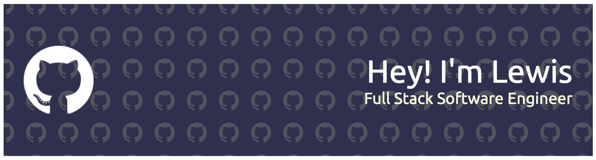

## 💫 About Me:
Hello! I'm a Toronto-based software engineer with a passion for problem-solving and a track record of building functional, secure, and scalable applications. I take pride in contributing to the success of projects, such as the super insurance agent app with over 2 million users worldwide. In addition to my coding expertise, I'm a team player who enjoys collaborating to overcome challenges. When I'm not coding, you'll find me on the basketball court, immersed in video games, or exploring the rich tapestry of Japanese culture.

Ready to explore my projects or discuss potential collaborations? Feel free to [contact me](mailto:lewisshum.work@gmail.com)!

- 👨‍💻 All of my projects are available [here](https://melodious-taffy-af8225.netlify.app).
- 📄 Know about my experiences [here](https://docs.google.com/document/d/1_FYj_PTrWCBNrbbg4OpervR_AE1_ZPaqbRMYrAJZJpQ/edit#heading=h.qfavqxf66yxg)

## 🌐 Socials:

## 💻 Tech Stack:
 
 
 
 
 
 
 
 
 
 
 
 
 
 
 
 
 
 
 
 
 
 
 
 
 
 
 
 
 
 
 
 
 
 
 
 
 
 
 
 
 
 
 
 
 
 
 
 
 

<!--
## 📊 GitHub Stats:

-->

## 🏆 GitHub Trophies
<!-- Add a title or description here -->

### ✍️ Random Dev Quote
<!-- Adjust the formatting if necessary -->

### 😂 Random Dev Meme
<!-- Adjust the height if necessary -->

---

